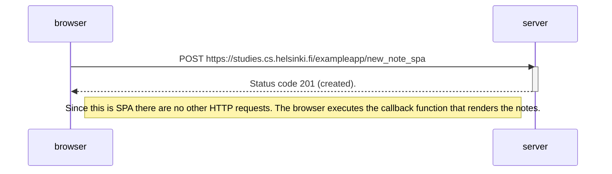

```mermaid

sequenceDiagram
    participant browser
    participant server
    
    browser->>server: POST https://studies.cs.helsinki.fi/exampleapp/new_note_spa
    activate server
    server-->>browser: Status code 201 (created). 
    deactivate server
    
    Note right of browser: Since this is SPA there are no other HTTP requests. The browser executes the callback function that renders the notes.
```